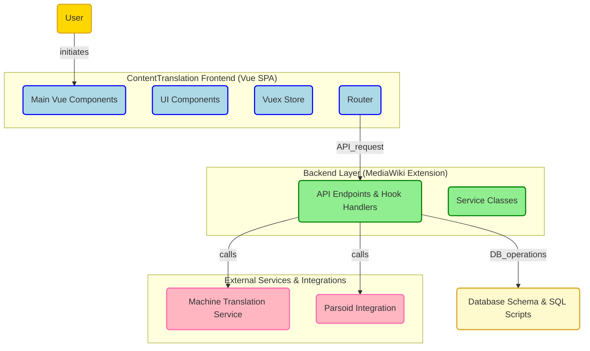

```mermaid
graph TD
    U("User"):::actor

    subgraph "ContentTranslation Frontend (Vue SPA)"
        A1("Main Vue Components"):::frontend
        A2("UI Components"):::frontend
        A3("Vuex Store"):::frontend
        A4("Router"):::frontend
    end

    subgraph "Backend Layer (MediaWiki Extension)"
        B1("API Endpoints & Hook Handlers"):::backend
        B2("Service Classes"):::backend
    end

    subgraph "External Services & Integrations"
        E1("Machine Translation Service"):::external
        E2("Parsoid Integration"):::external
    end

    D1("Database Schema & SQL Scripts"):::database

    U -->|"initiates"| A1
    A4 -->|"API_request"| B1
    B1 -->|"DB_operations"| D1
    B1 -->|"calls"| E1
    B1 -->|"calls"| E2

    click A1 "https://github.com/mdwikicx/cx-1/tree/main/app/src"
    click A2 "https://github.com/mdwikicx/cx-1/tree/main/app/src/components"
    click A3 "https://github.com/mdwikicx/cx-1/tree/main/app/src/store"
    click A4 "https://github.com/mdwikicx/cx-1/tree/main/app/router"
    click B1 "https://github.com/mdwikicx/cx-1/tree/main/includes/ActionApi"
    click B2 "https://github.com/mdwikicx/cx-1/tree/main/includes/Service"
    click D1 "https://github.com/mdwikicx/cx-1/tree/main/sql/"
    click E1 "https://github.com/mdwikicx/cx-1/blob/main/modules/mw.cx.MachineTranslationService.js"
    click E2 "https://github.com/mdwikicx/cx-1/blob/main/includes/ParsoidClient.php"

    classDef actor fill:#FFD700,stroke:#DAA520,stroke-width:2px;
    classDef frontend fill:#ADD8E6,stroke:#0000FF,stroke-width:2px;
    classDef backend fill:#90EE90,stroke:#008000,stroke-width:2px;
    classDef database fill:#FFFACD,stroke:#DAA520,stroke-width:2px;
    classDef external fill:#FFB6C1,stroke:#FF69B4,stroke-width:2px;
```
